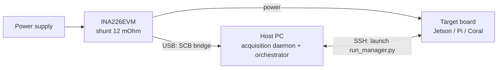

# Direct INA226 Acquisition — Design Sketch

**Status:** proposal / skeleton (no implementation yet)
**Chosen approach:** script the INA226EVM's onboard USB bridge (SCB controller) directly from the host PC with Python — **zero new hardware**. The TI web GUI is only a browser front-end talking to that bridge; we replace the browser with a Python acquisition daemon on the same machine. A companion-device I2C setup is kept as documented fallback (Section 8) in case the USB protocol turns out to be impractical.

**Goal:** programmatic start/stop, real per-sample timestamps, and automatic file naming — removing the human from the acquisition loop.

**Motivation (recap):** the current protocol requires a human to click "COLLECT DATA" in the TI GUI, wait, click stop, save, and manually rename `main.csv` to `Linear_<in>_<out>.csv`. Every step is a chance for operator error (wrong name, late start, forgotten stop), and the exported CSV has no absolute timestamps. Automating acquisition removes all of this and enables unattended measurement campaigns over the full layer grid.

---

## 1. Architecture Overview

Two roles, both on machines you already have:

| Role | Runs | Responsibility |
|------|------|----------------|
| **Host PC** (currently the Windows PC connected to the EVM) | acquisition daemon + orchestrator | Talks to the EVM over the existing USB cable, samples at a fixed rate, buffers to disk; knows the layer grid, launches inference on the target via SSH, names and stores the output files |
| **Target board** | `run_manager.py` (unchanged role) | Runs the inference bursts |

**Why this is measurement-pure:** acquisition runs on the host PC, exactly as with the TI GUI today — nothing changes electrically or on the device under test. The physical setup (PSU → shunt → board, EVM → USB → PC) stays untouched; only the *software reading the EVM* changes.

**Practical note:** the daemon is plain Python + `pyserial`, so the host PC can stay Windows or be swapped for any Linux laptop — whatever is most convenient at the bench. Daemon and orchestrator live on the same machine, so the "control interface" between them can be an in-process API rather than a network service.

---

## 2. USB Bridge Protocol Discovery Procedure

This is the critical unknown and therefore **phase 0** of the project. The EVM's SCB controller is a USB-to-I2C bridge; the TI GUI Composer web app sends it read/write-register commands. The task is to learn to speak that protocol from Python:

1. **Identify the USB device.** Plug the EVM into a Linux machine and check what enumerates: `lsusb` (vendor/product ID) and whether a CDC-ACM serial port appears (`/dev/ttyACM*`) or an HID device. A serial port is the best case — `pyserial` territory.
2. **Look for documentation first.** Check TI's resources for the EVM: the GUI Composer application bundle (the web app's JavaScript is downloadable and readable — the protocol framing is implemented in it), TI E2E forum threads, and any published "SCB communication protocol" application notes. Other TI sensor EVMs use a documented ASCII/JSON command protocol over the virtual COM port — there is a fair chance this one does too.
3. **If undocumented, sniff it.** Run the official web GUI while capturing USB traffic (Wireshark + usbmon on Linux, or USBPcap on Windows). Trigger known actions one at a time — connect, set RSHUNT, start collect, stop — and diff the captures. Register addresses from the INA226 datasheet (config `0x00`, bus voltage `0x02`, power `0x03`, calibration `0x05`) will be recognizable in the payloads and anchor the reverse engineering.
4. **Prototype the minimal command set.** Only four capabilities are needed: write a register (config, calibration), read a register (power, bus voltage, current), and optionally the bridge's own init/handshake sequence. Reproduce them from a Python REPL and verify readings against the GUI.
5. **Document the findings** in this repo (frame format, endianness, timing quirks) so the knowledge is never a single person's again.
6. **Time-box the effort.** If steps 1–4 don't yield a working register read within a reasonable effort budget, fall back to the companion-device I2C plan (Section 8) — the rest of this design is transport-agnostic and survives that switch unchanged.

---

## 3. INA226 Configuration Procedure

All values live in one config file, mirrored from the current TI GUI settings so results stay comparable:

1. **Calibration register** — computed from `R_shunt = 12 mΩ` and max expected current (3 A for Jetson Nano / Coral; ~5 A for Pi 5 — note the Current_LSB and calibration value differ per board, so this is a per-board config entry, which the GUI workflow handled implicitly). Written through the bridge at daemon startup.
2. **Conversion time and averaging** — choose bus/shunt conversion times and the on-chip averaging count so that one averaged conversion completes comfortably within the 100 ms sample period. On-chip averaging replaces part of the software median filter's job (it suppresses sub-sample switching noise before we ever see it) — document this so the DSP pipeline's filter parameters can be revisited later.
3. **Operating mode** — continuous shunt + bus conversion.
4. **Readout registers** — read the power register (and optionally bus voltage + current for cross-checking `P ≈ V·I` as a per-sample sanity check).
5. **Verification step:** with a known resistive load (or the board idle at a known draw), compare daemon readings against a multimeter and against a TI GUI capture before trusting the new path.

---

## 4. Acquisition Daemon — Behavioral Specification

A single Python process on the host PC, speaking to the EVM through the bridge protocol from Section 2. No code here, only the contract:

### States
`IDLE` → (start command) → `RECORDING` → (stop command) → `FINALIZING` → `IDLE`

### Sampling loop (RECORDING)
1. Sleep-until-next-tick scheduling against a **monotonic clock** (not `sleep(0.1)` in a loop — that accumulates drift).
2. Each sample row: monotonic timestamp, wall-clock timestamp, power (W), optionally bus voltage (V) and current (A), sequence number.
3. Write append-only to disk (CSV or Parquet chunks) — never buffer the whole campaign in RAM, so a crash loses seconds, not hours.
4. **Bridge error policy:** on a failed/garbled read, retry N times with short backoff; on persistent failure (e.g., USB reset under the Pi 5's transient load), attempt to reopen the serial port and re-init the bridge; log every gap explicitly (sequence numbers make gaps visible downstream) and keep the daemon alive. This directly addresses the "USB dropout" failure mode of the old pipeline — gaps become *detectable data*, not silent corruption.

### Control interface
Daemon and orchestrator run on the same machine, so the smallest thing that works is an in-process API (the daemon as an importable class) with three operations — a networked wrapper can be added later if remote control is ever needed:
- `start(campaign_metadata)` — metadata includes board, layer spec, `nb_run`, inference `count`, seed. The daemon embeds it in the output file header/sidecar. **This is what kills the manual rename step:** the file is born with the right identity.
- `stop()` — finalize file, return its path and a capture summary (n samples, gaps, duration).
- `status()` — state, current file, sample count, last power reading (useful for a live sanity check).

### Output contract
- One file per campaign, named from the layer spec (single naming function shared with the rest of the codebase — the `LayerSpec` idea from the review report).
- Sidecar JSON manifest: all campaign metadata + acquisition stats (sample count, gap count, effective sample rate, INA226 config used).
- Backward compatibility: an export mode producing the legacy `Sample` / `EVM1 POWER Results (W)` column layout so `data_processing.py` works unmodified during the transition.

---

## 5. Orchestrator — Campaign Procedure

The orchestrator script (same machine as the daemon) automates the whole measurement protocol for one or many layer configs:

1. Read the campaign plan (list of layer specs, per-board settings) from a config file.
2. For each layer spec:
   1. `status()` check on the daemon (fail fast if the INA226 is unreachable).
   2. `start(metadata)` acquisition.
   3. Wait a fixed **leading idle guard time** (≥ the DSP rolling window, e.g. 10 s) so every capture begins with a clean baseline.
   4. Launch inference on the target via SSH: `run_manager.py --model <spec> --nb_run ... --count ...`. Capture its exit code and stdout.
   5. Wait a **trailing idle guard time**.
   6. `stop()` — receive file path + capture summary.
   7. Validate immediately: expected number of bursts present? sample gaps? (cheap checks; full DSP later). On failure, mark the spec for re-run and continue the campaign.
3. Emit a campaign-level manifest: per-spec status (ok / failed / re-run), file paths, target's exit codes.

Optional later step: fold the sync-beacon idea into `run_manager.py` (a deterministic burst pattern at campaign start) — with real timestamps on both sides it becomes a cross-check rather than a necessity.

---

## 6. Migration Plan (incremental, low-risk)

| Phase | What | Exit criterion |
|-------|------|----------------|
| 0 | **Protocol discovery** (Section 2): identify device, obtain or reverse-engineer the bridge protocol, read one register from Python | A plausible idle power reading printed from a Python REPL |
| 1 | Daemon sampling loop + local file output, manual start/stop | 10-min capture: correct sample count, jitter within budget |
| 2 | **Side-by-side validation:** daemon capture vs. TI GUI capture of the same repeatable workload (sequential runs, same layer spec) | Power averages agree within sensor tolerance; `data_processing.py` yields matching `energy_avg_J` on both files |
| 3 | In-process control API + orchestrator for a single spec | One command runs a full measured campaign, correctly named output |
| 4 | Full-grid campaigns + manifest + auto re-run of failures | Unattended overnight run of a full Linear grid |
| 5 | Retire the TI GUI path; update the measurement protocol doc | New protocol document |

If phase 0 fails its time-box, switch to the fallback (Section 8); phases 1–5 apply unchanged.

---

## 7. Risks / Open Questions

- **The bridge protocol may be undocumented** — the main project risk, mitigated by the time-boxed phase 0 and the I2C fallback (Section 8). The GUI's own JavaScript is the most reliable "documentation": it demonstrably speaks the protocol.
- **OS-level serial timing on the host PC:** a non-realtime OS adds jitter to the 100 ms tick. At 10 Hz this is negligible if the daemon timestamps each sample when received (monotonic clock) instead of assuming the nominal period — the timestamps, not the tick, are the ground truth downstream.
- **USB resets under load transients** (Pi 5 near 5 A): the reopen-and-resume policy in Section 4 must be tested deliberately, e.g., by unplugging/replugging the EVM mid-capture and verifying the gap is correctly recorded.
- **Sampling rate ceiling:** 10 Hz is trivial, but the bridge's command round-trip sets an upper bound; measure it in phase 0. If a future need for 100+ Hz arises, evaluate the fallback I2C path with hardware-timed reads or a different sensor (INA228).
- **Per-board calibration profiles:** Pi 5 at ~5 A needs a different Current_LSB than 3 A boards; the config must make the active profile explicit and record it in every manifest (the GUI workflow left this undocumented per capture).
- **Clock sync between host PC and target:** wall-clock timestamps are informative but NTP-level sync (~ms) is more than sufficient at 10 Hz; document that assumption.

---

## 8. Fallback: Companion Device over I2C

If the USB bridge protocol resists discovery, switch the transport — everything from Section 3 onward is unchanged:

- Attach a cheap companion board (e.g., Raspberry Pi Zero, ~€15) to the INA226's I2C pins broken out on the EVM (SDA, SCL, GND; address jumpers A0/A1, default `0x40`), reading via `smbus2`.
- Verify from the EVM schematic that the onboard SCB controller can be left unpowered/isolated so two I2C masters never share the bus; alternatively use a bare INA226 breakout board (a few euros) and leave the EVM untouched.
- The daemon and orchestrator then run on the companion device (self-contained measurement appliance controlled over SSH), and the control interface becomes a small networked endpoint instead of in-process.
- Do **not** run acquisition on the target board itself: the sampling loop's own activity contaminates the idle baseline that the P_offset subtraction depends on.

### Alternatives comparison (for the record)

| Option | New hardware | Effort | Measurement purity |
|--------|--------------|--------|--------------------|
| **Script the EVM's USB bridge from the host PC (chosen)** | none | unknown until phase 0 (protocol may be undocumented) | perfect — identical to today's setup |
| Companion Pi Zero over I2C (fallback) | ~€15 | low, well-trodden path | perfect |
| Target board reads its own INA226 | none | low | slightly biased idle baseline — rejected |
