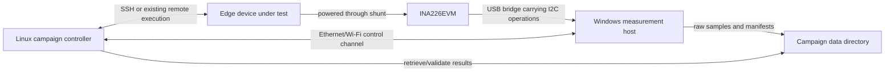

# INA226 Automated Acquisition with Linux Control and a Windows Measurement Host

**Status:** Design skeleton — procedure only, no implementation  
**Date:** 2026-07-12  
**Goal:** Replace manual TI web-GUI acquisition with an automated, reproducible measurement service while using only:

1. the local Linux machine as the campaign controller; and
2. the existing Windows machine connected to the INA226EVM as the measurement host.

---

## 1. Important hardware constraint

A standard Windows or Linux PC does not expose an I²C bus through an ordinary USB port. Therefore, `smbus2` cannot communicate directly with the INA226 merely because the INA226EVM is connected by USB.

The existing INA226EVM contains or uses a USB controller/bridge between the Windows PC and the INA226 I²C bus. With the two-machine constraint, there are two technically distinct possibilities:

### Preferred path: reuse the INA226EVM USB-to-I²C bridge

The Windows acquisition daemon communicates with the EVM's existing USB bridge. The bridge then performs I²C register operations against the INA226.

This is still direct programmatic INA226 acquisition at the register level, but the PC transport is USB rather than a native PC I²C controller.

Advantages:

- no additional companion board;
- no electrical changes to the current testbed;
- measurement software remains off the device under test;
- the Windows PC already has the required physical connection;
- the Linux machine can control campaigns remotely.

Main uncertainty:

- the EVM bridge protocol may be undocumented and may need to be obtained from TI resources, the GUI application, or USB capture analysis.

### Alternative path: add a supported USB-to-I²C adapter

If the EVM bridge cannot be controlled outside the TI GUI, the Windows machine needs a supported USB-to-I²C adapter connected to the INA226 I²C pins.

This is true external I²C access, but it introduces additional hardware. It must also be verified that the EVM's onboard controller is electrically isolated so two I²C masters never drive the bus simultaneously.

### Inapplicable path under the stated constraint: `smbus2` on a companion device

`smbus2` is appropriate on a Raspberry Pi or similar device exposing `/dev/i2c-*`. It is not the normal interface for the existing EVM USB connection on Windows. Since the desired setup uses only Linux and Windows PCs, the initial design should target the EVM USB bridge rather than assume `smbus2` is available.

---

## 2. Proposed two-machine architecture



### Linux machine responsibilities

- hold the campaign plan;
- select the board, backend, model, and layer specification;
- remotely verify that Windows acquisition is healthy;
- request acquisition start and stop;
- trigger inference on the device under test;
- collect target exit status and burst events;
- retrieve or access the resulting capture and manifest;
- run immediate quality checks;
- queue failed measurements for rerun;
- later run the full DSP and lookup-table publication pipeline.

### Windows machine responsibilities

- own exclusive access to the INA226EVM USB device;
- configure and verify the INA226;
- sample electrical registers at the requested rate;
- timestamp every sample with a monotonic clock;
- recover from transient USB errors where possible;
- record gaps explicitly;
- write raw data incrementally;
- finalize a metadata manifest;
- expose a small authenticated control interface to Linux.

### Device-under-test responsibilities

- load the model before measured execution;
- warm up outside measured bursts;
- wait for an explicit start command;
- emit `READY`, `BURST_START`, `BURST_END`, and final status events;
- report requested and actually executed inference counts;
- synchronize asynchronous accelerators before declaring a burst complete.

The acquisition daemon must not run on the device under test because its own CPU, I/O, and scheduling activity would contaminate the measured idle baseline.

---

## 3. Recommended communication model

### Linux to Windows control

The simplest initial control path is Windows OpenSSH Server:

- Linux invokes narrowly defined acquisition commands remotely;
- Windows returns machine-readable status;
- capture files can be retrieved with SFTP/SCP;
- no custom public web service is required initially.

A later local REST or message-based service is possible, but it adds authentication, firewall, lifecycle, and concurrency concerns that are unnecessary for the first prototype.

### Linux to target control

Use SSH or the existing target terminal mechanism, but introduce a structured event stream. Plain human-oriented output is insufficient for reliable synchronization.

### Network requirements

- Linux, Windows, and the target should use the same isolated test network where practical.
- Windows should have a stable hostname or address.
- Key-based SSH authentication should be used for unattended campaigns.
- Windows firewall rules should permit only the required management traffic from the Linux controller.
- The control interface must bind to a trusted network only.

---

# 4. Phase 0 — Establish whether the existing EVM bridge is controllable

This is the first technical gate. Do not design the rest of the daemon around an assumed serial protocol until this is verified.

## 4.1 Identify the Windows USB device

On the Windows measurement host:

1. Connect the INA226EVM exactly as in the existing protocol.
2. Inspect Device Manager while disconnecting and reconnecting the EVM.
3. Record:
   - vendor ID and product ID;
   - device class;
   - COM-port assignment, if any;
   - HID or WinUSB identity, if applicable;
   - driver provider and version;
   - USB serial number, if exposed.
4. Confirm whether the TI GUI opens the same device exclusively.
5. Save these details in a testbed inventory file.

Possible transport categories:

- CDC/virtual COM port;
- HID device;
- WinUSB/libusb-compatible device;
- proprietary TI driver;
- a local service used by the TI web application.

## 4.2 Search for the protocol before reverse engineering

Inspect official and locally installed resources in this order:

1. INA226EVM and controller documentation from TI.
2. TI GUI Composer application resources.
3. JavaScript, JSON, XML, or configuration files downloaded by the web GUI.
4. TI E2E support discussions concerning the EVM controller protocol.
5. Driver installation directories and application logs.
6. Existing open-source drivers for the exact USB vendor/product ID.

Look for operations corresponding to:

- initialize controller;
- select I²C address;
- write register;
- read register;
- set bus speed;
- start/stop streaming;
- configure endianness and transfer length.

## 4.3 Observe the official GUI if documentation is insufficient

Use the official GUI only as a protocol-discovery reference:

1. Capture USB traffic with USBPcap and inspect it with Wireshark.
2. Perform one GUI action at a time.
3. Record separate captures for:
   - opening the device;
   - reading a known register;
   - changing one configuration value;
   - starting acquisition;
   - stopping acquisition.
4. Compare request and response frames.
5. Use known INA226 register addresses and expected values as anchors.
6. Document framing, checksums, sequence numbers, endianness, and timing requirements.

Relevant INA226 registers include configuration, shunt voltage, bus voltage, power, current, calibration, mask/enable, and alert limit. Exact addresses and scaling must be checked against the specific INA226 datasheet revision before implementation.

## 4.4 Minimal phase-0 exit criterion

Phase 0 passes only when a standalone Windows process can:

1. open the EVM bridge without the TI GUI;
2. read at least one known INA226 register;
3. obtain a plausible bus-voltage or power value;
4. repeat reads without destabilizing the device;
5. close and reopen the connection successfully.

If this cannot be achieved within the chosen time budget, stop reverse engineering and evaluate a supported USB-to-I²C adapter. Do not build an unreliable parser around incomplete protocol assumptions.

---

# 5. Phase 1 — Define and verify the INA226 configuration

All measurement-affecting values must live in a versioned board profile and be copied into every campaign manifest.

## 5.1 Board profile contents

For each target board, record:

- INA226 I²C address;
- shunt resistance and tolerance;
- expected minimum and maximum current;
- current-LSB selection;
- calibration register value;
- bus- and shunt-conversion times;
- internal averaging count;
- conversion mode;
- nominal sampling interval;
- expected bus-voltage range;
- plausible current and power ranges;
- sensor/EVM identity;
- power supply and cable configuration;
- testbed revision.

A Pi 5 campaign near 5 A must not silently reuse a calibration profile designed for a lower-current Jetson or Coral campaign.

## 5.2 Startup verification

Whenever the Windows daemon opens or reopens the bridge:

1. read the device/controller identity where possible;
2. write the desired INA226 configuration;
3. write the calibration register;
4. read configuration and calibration back;
5. verify that returned values match the requested profile;
6. read several voltage/current/power samples;
7. reject impossible or non-finite values;
8. verify approximately that $P \approx VI$;
9. confirm that fresh samples arrive at the expected cadence.

A USB reconnection is not considered recovered until this complete handshake passes.

## 5.3 Bench validation

Before replacing the GUI workflow:

1. measure a stable idle or known resistive load;
2. capture it through the TI GUI;
3. capture it through the new Windows process under equivalent settings;
4. compare raw voltage/current/power distributions;
5. compare timestamps and effective sampling rate;
6. compare downstream energy results;
7. document acceptable tolerance based on sensor, shunt, and timing uncertainty.

---

# 6. Phase 2 — Windows acquisition daemon behavior

## 6.1 Lifecycle states

The Windows daemon should use explicit states:

- `STOPPED`: process not serving requests;
- `IDLE`: device initialized and ready;
- `ARMING`: campaign metadata accepted and output prepared;
- `RECORDING`: samples are being acquired;
- `RECOVERING`: transport failed and reconnection is in progress;
- `FINALIZING`: data and metadata are being committed;
- `FAILED`: current campaign cannot be accepted.

Only one campaign may own the sensor at a time.

## 6.2 Control operations

The first version needs only a small stable contract:

### `health`

Returns:

- daemon version;
- state;
- bridge/device identity;
- active board profile;
- last successful read time;
- latest plausible power value;
- total read/reconnect errors;
- free output-disk space.

### `arm`

Accepts immutable campaign metadata before recording:

- campaign ID;
- target board and hardware revision;
- layer type and complete parameters;
- backend and precision;
- model artifact identity;
- requested cycle and inference counts;
- random seed;
- board/calibration profile;
- desired sample rate;
- output dataset identity.

The Windows host derives the output filename from this metadata. The operator never manually renames a CSV.

### `start`

Begins sampling and returns only after several consecutive valid samples have been written.

### `mark`

Records host-received campaign events such as `TARGET_READY`, `BURST_START`, and `BURST_END` in the acquisition event log.

### `stop`

Stops sampling, flushes data, calculates acquisition-health statistics, finalizes the manifest, and returns the capture paths and status.

### `abort`

Stops safely while preserving partial data and marks the campaign rejected.

### `status`

Returns active campaign, sample count, gap count, elapsed time, last reading, and current state.

## 6.3 Sampling scheduler

The sampling loop should schedule against a monotonic clock rather than repeatedly sleeping for 100 ms. Repeated relative sleeps accumulate drift.

For each desired tick:

1. determine the next target time from a fixed monotonic origin;
2. wait until the target time;
3. perform the sensor read;
4. timestamp when the response is received;
5. append the row immediately;
6. advance the sequence number even if the read fails;
7. calculate timing lateness and jitter.

Real timestamps, not nominal sample numbers, are the ground truth for energy integration.

## 6.4 Failure and reconnection policy

On a failed read:

1. classify the error;
2. record a failed-sample row or explicit gap event;
3. retry a small bounded number of times with short backoff;
4. if still failing, transition to `RECOVERING`;
5. close the stale USB handle;
6. wait for the configured USB device to reappear;
7. reopen it;
8. repeat controller and INA226 initialization;
9. verify calibration and plausible samples;
10. resume recording only after successful verification.

Campaign policy:

- a brief gap outside all measured/baseline windows may be retained but must remain visible;
- any gap overlapping a burst or required local baseline invalidates the campaign;
- a long recovery or repeated reset invalidates the campaign;
- recovery never erases the fact that data was missing;
- partial files remain diagnostic artifacts and are not NAS inputs.

## 6.5 Incremental, crash-resistant storage

Do not hold a complete campaign only in memory.

Recommended behavior:

- create a temporary campaign directory during `arm`;
- append samples in bounded chunks;
- periodically flush buffers to disk;
- write events to a separate append-only log or table;
- update a temporary manifest with lifecycle status;
- finalize by atomically renaming the directory or manifest;
- retain an explicit `INCOMPLETE` state after an unexpected process stop.

---

# 7. Phase 3 — File and metadata layout

## 7.1 Canonical directory identity

Use an immutable campaign ID, for example a generated unique identifier plus a human-readable layer label. Do not use the human-readable filename as the sole identity.

Conceptual layout:

```text
campaigns/
  <campaign-id>/
    samples.csv-or-parquet
    events.jsonl
    manifest.json
    acquisition.log
```

## 7.2 Sample fields

Minimum sample schema:

| Field | Meaning |
|---|---|
| `campaign_id` | Immutable campaign identity |
| `sequence` | Expected monotonically increasing sample sequence |
| `monotonic_ns` | Windows monotonic receive timestamp |
| `wall_time_utc` | Human/audit timestamp |
| `power_W` | INA226-derived power |
| `bus_voltage_V` | INA226 bus voltage |
| `current_A` | INA226 current |
| `shunt_voltage_V` | Optional cross-check value |
| `read_status` | `OK`, timeout, malformed, reconnecting, etc. |
| `retry_count` | Number of attempts for this sample |
| `lateness_ms` | Delay relative to scheduled sampling tick |
| `burst_id` | Burst association when known |

## 7.3 Manifest fields

Minimum manifest sections:

- campaign identity and timestamps;
- Linux controller identity/version;
- Windows daemon identity/version;
- target board and software identity;
- complete typed layer specification;
- backend, precision, and model artifact hash;
- requested and executed cycles/inferences;
- INA226 and shunt configuration;
- USB bridge identity and driver version;
- sampling configuration and observed effective rate;
- sample, retry, gap, and reconnect counts;
- burst/event reconciliation;
- output file hashes;
- final status and failure codes;
- processing/QC version when processed later.

## 7.4 Legacy export

A compatibility export may provide the old `Sample` and `EVM1 POWER Results (W)` columns. However, the timestamped canonical capture and manifest must remain authoritative. Legacy export must never discard the original health/gap information.

---

# 8. Phase 4 — End-to-end campaign procedure

## 8.1 Preflight on Linux

For each campaign:

1. validate the campaign plan and layer specification;
2. verify network access to Windows and the target;
3. request Windows `health`;
4. verify the expected EVM identity and board profile;
5. verify sufficient Windows disk space;
6. verify target temperature, power mode, and clock state;
7. verify that no other process owns the EVM;
8. generate the immutable campaign ID.

If any preflight check fails, do not start inference.

## 8.2 Arm acquisition

1. Linux sends complete campaign metadata to Windows.
2. Windows validates it and creates the temporary output location.
3. Windows rechecks or applies the INA226 profile.
4. Windows returns `ARMED` with the exact campaign ID and profile hash.

## 8.3 Prepare target

1. Linux starts the target runner.
2. Target loads the model and input.
3. Target runs unmeasured warm-up.
4. Target synchronizes the accelerator.
5. Target reports `READY` with model/layer identity.
6. Linux verifies that target identity matches the armed campaign.

## 8.4 Start acquisition and collect idle baseline

1. Linux sends `start` to Windows.
2. Windows returns only after valid samples are arriving.
3. Linux waits for a configured leading-idle interval.
4. Linux checks Windows `status` for gaps or implausible readings.
5. If acquisition is unhealthy, Linux aborts before any measured burst.

## 8.5 Execute synchronized bursts

For every burst:

1. Linux creates a unique burst ID.
2. Linux records/sends the planned start event.
3. Linux tells the target to run the burst.
4. Target emits `BURST_START` immediately before inference.
5. Target executes the exact inference count.
6. Target synchronizes the accelerator.
7. Target emits `BURST_END` with actual count and duration.
8. Linux forwards or records these markers on Windows.
9. Linux waits for the configured idle/cooling interval.
10. Linux checks acquisition health before continuing.

If the target or Windows reports a fatal condition, stop issuing bursts and abort safely.

## 8.6 Stop and finalize

1. After the last burst, keep recording for the trailing-idle interval.
2. Linux requests Windows `stop`.
3. Windows flushes samples and events.
4. Windows calculates acquisition-health statistics.
5. Windows finalizes and hashes the output files.
6. Windows returns the final capture status and paths.
7. Linux retrieves or accesses the finalized artifacts.

## 8.7 Immediate quality gate

Before moving to the next layer, Linux checks:

- expected file and manifest exist;
- campaign identity matches;
- expected and reported burst counts match;
- requested and executed inference counts match;
- no gap overlaps a burst or required idle baseline;
- observed sampling rate and jitter are acceptable;
- leading/trailing idle data are sufficient;
- power, voltage, and current are finite and plausible;
- target did not report throttling, OOM, or execution failure;
- file hashes and final status are valid.

Failed campaigns are added to a rerun queue and remain visible in the campaign-level report.

---

# 9. Timing and synchronization strategy

## 9.1 Clock roles

Each machine should timestamp events with its own monotonic clock and UTC wall clock.

- monotonic time is used for durations and ordering;
- UTC time assists cross-machine correlation and audit;
- clocks should be synchronized with NTP, but wall-clock equality must not be assumed to be exact.

## 9.2 Why network markers are still useful

Network markers have variable delivery delay, but they provide strong campaign identity and ordering. Power segmentation should reconcile:

1. target-measured burst duration;
2. host-received event times;
3. expected burst pattern;
4. observed power transition.

For 10 Hz acquisition, measured bursts should be intentionally long enough that network jitter and a one-sample boundary uncertainty do not dominate the result.

## 9.3 Optional synchronization beacon

At campaign start, run a distinctive pattern such as:

- short burst;
- idle gap;
- long burst;
- idle gap;
- short burst.

The known pattern allows automatic alignment checks between target events and the power trace. It should be marked as synchronization activity and excluded from energy lookup metrics.

---

# 10. Security and operational safeguards

## 10.1 Windows access

- Use a dedicated non-administrator acquisition account where possible.
- Use SSH keys rather than stored passwords in scripts.
- Restrict command execution to the acquisition service or wrapper.
- Limit firewall access to the Linux controller.
- Do not expose the acquisition service to the public network.

## 10.2 Sensor ownership

- Only one daemon process may open the EVM.
- The TI GUI must remain closed during automated acquisition.
- A lock file alone is insufficient; verify actual device ownership.
- Every command must include the active campaign ID to prevent stale stop/abort requests affecting another campaign.

## 10.3 Safe shutdown

On Ctrl+C, service stop, Windows shutdown, or network loss:

- stop accepting new bursts;
- preserve buffered samples;
- mark the campaign incomplete;
- close the USB device cleanly;
- leave enough metadata to diagnose and rerun the campaign.

A Linux network disconnect should not immediately destroy data already collected on Windows. The Windows host should finish local finalization even if it cannot report back immediately.

---

# 11. Validation plan

## Stage A — Register-level validation

Exit criteria:

- repeatable standalone register reads;
- correct configuration readback;
- plausible voltage/current/power;
- clean open/close/reopen behavior.

## Stage B — Sampling validation

Run a stable load for at least ten minutes and verify:

- expected sample count;
- bounded jitter;
- no cumulative scheduler drift;
- no unexplained sequence gaps;
- stable memory use;
- crash-resistant output.

## Stage C — GUI comparison

Run equivalent workloads using the TI GUI and the daemon in separate captures. Verify agreement within documented tolerance for:

- idle power;
- active power;
- net power;
- active duration;
- integrated energy.

## Stage D — Fault injection

Deliberately test:

- USB unplug/replug during idle;
- USB unplug/replug during a burst;
- delayed and malformed responses;
- Windows daemon restart;
- Linux-to-Windows network interruption;
- target SSH interruption;
- target process failure;
- low Windows disk space;
- stale campaign commands.

Verify that no affected campaign can be marked `OK` or published to NAS.

## Stage E — Unattended campaign

Run a representative Linear and Conv2d subset overnight. Exit criteria:

- no manual GUI interaction;
- all files named from campaign metadata;
- every layer has an explicit final status;
- failures are rerunnable without ambiguity;
- no `NaN` or incomplete row reaches the accepted lookup table.

---

# 12. Implementation phases and decision gates

| Phase | Deliverable | Exit criterion |
|---|---|---|
| 0 | EVM USB bridge discovery | Standalone plausible INA226 register read on Windows |
| 1 | INA226 profile and verification procedure | Configuration readback and stable known-load measurements |
| 2 | Local Windows daemon | Timestamped, incremental ten-minute capture with manifest |
| 3 | Linux remote control | Linux can health/arm/start/status/stop and retrieve results |
| 4 | Target handshake | `READY` and burst events reconcile with acquisition |
| 5 | Immediate QC and rerun queue | Failed campaigns are rejected and scheduled again |
| 6 | Full campaign automation | Unattended Linear/Conv2d subset with no manual rename |
| 7 | GUI retirement | Automated path validated and protocol documentation updated |

### Stop/go decision after phase 0

- **Go:** the existing EVM bridge permits stable programmatic register access. Continue with the two-PC, no-extra-device architecture.
- **Stop:** protocol access is unreliable or legally/operationally unsuitable. Select a documented USB-to-I²C adapter or retain the GUI temporarily. Do not proceed with an unverified protocol implementation.

---

# 13. Recommended first practical experiment

The smallest useful experiment is not a complete daemon. It is a Windows-only proof of transport:

1. identify the exact EVM USB device and driver;
2. determine whether it exposes COM, HID, WinUSB, or a TI service;
3. close the TI GUI;
4. open the device from a standalone process;
5. perform one known register read;
6. decode a plausible bus voltage;
7. repeat the read at 10 Hz for five minutes;
8. close and reopen the device;
9. repeat after a deliberate unplug/replug;
10. document the protocol and observed failure behavior.

Only after this succeeds should the Linux remote-control and campaign orchestration layers be designed in detail.

---

# 14. Final recommendation

Given the requirement to use only the local Linux machine and the existing Windows measurement PC, the recommended design is:

- **Windows:** exclusive sensor/acquisition host using the INA226EVM's existing USB-to-I²C bridge;
- **Linux:** campaign controller, target orchestrator, QC coordinator, and long-term data processor;
- **target board:** inference execution only.

Do not begin with `smbus2` unless a machine in the final setup actually exposes the INA226 through a native Linux I²C device. For the current Windows-attached EVM, first prove access to the EVM's USB bridge. This preserves the present electrical setup, removes GUI interaction and manual renaming, and keeps acquisition overhead off the device whose energy is being measured.
